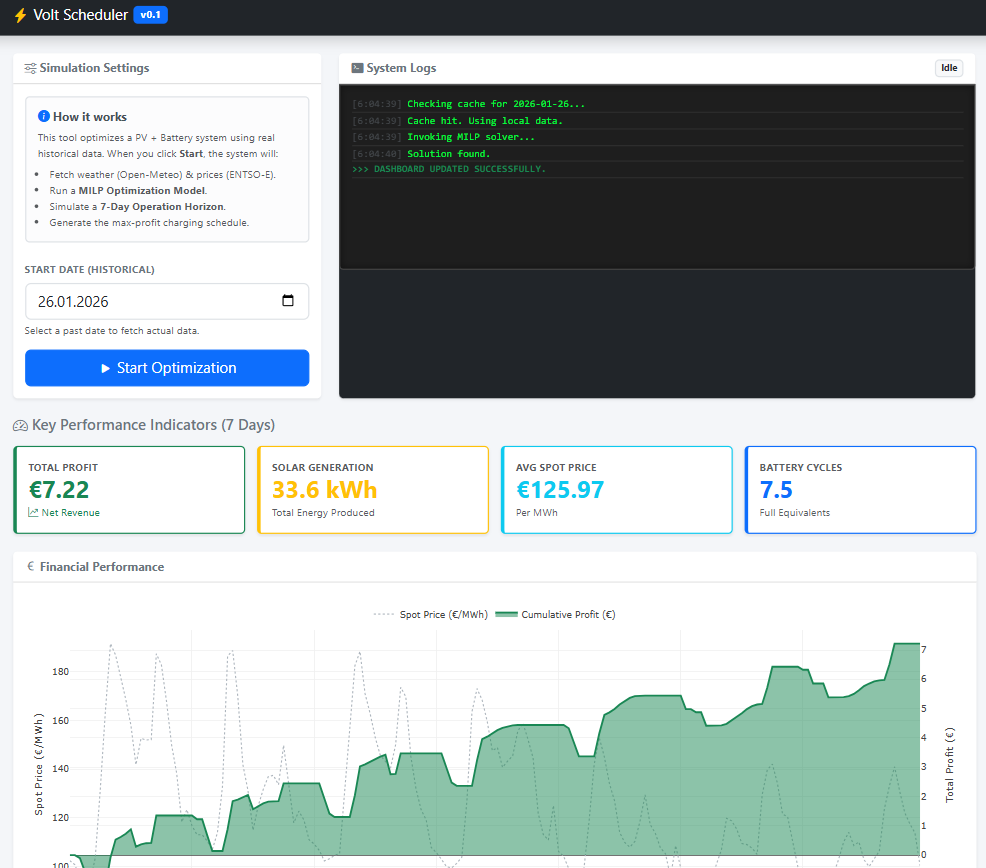

# Volt-Optimizer: BESS Arbitrage Framework

Volt-Optimizer is a proof-of-concept implementation of **Mixed-Integer Linear Programming (MILP)** applied to energy storage dispatch. The framework automates battery scheduling by resolving high-dimensional trade-offs between day-ahead market pricing and local solar forecasting.

> [!IMPORTANT]
> **Provisioning Delay:** This demo runs on Render's free tier. If the service is cold, initialization may take up to **50 seconds**. Once the containers are provisioned, simulation and data ingestion proceed in real-time.

---

## 🔬 Core Objectives
This experimental project explores the integration of mathematical optimization with modern cloud-native architecture. It provides a blueprint for transforming raw time-series telemetry from utility-scale APIs into an economically optimal dispatch schedule for a Battery Energy Storage System (BESS).

## 🧠 Optimization Engine (MILP)

The system resolves an hourly dispatch problem over a 7-day rolling horizon. The objective function is defined by profit maximization—specifically, the delta between grid exports and imports.

### Technical Formulation
* **Nodal Balance**: Enforces energy conservation at the point of common coupling (PCC):
    $$P_{import} + P_{pv} + P_{discharge} = P_{export} + P_{charge}$$
* **System Dynamics**: The model handles round-trip efficiency ($\eta$) as a non-linear constraint approximated for linear solvers. Charging power is scaled by $\eta$, while discharging power is divided by $\eta$ to account for internal conversion losses.
* **Operational Constraints**: The solver respects boundary conditions for State of Charge (SoC) and power-to-energy (C-rate) limits.
* **Complementarity Logic**: Binary decision variables prevent simultaneous charge/discharge states, ensuring a physically feasible solution.

## 🏗️ Architecture & Implementation

Built using a microservices pattern, the system prioritizes separation of concerns between computational logic and data delivery.

### 1. Data Ingestion & Persistence
The backend integrates with the **ENTSO-E Transparency Platform** (Market prices) and **Open-Meteo** (Irradiance) via custom adapters.
* **Proactive Caching**: The system queries local persistence before triggering external API calls.
* **Coverage Validation**: To maintain optimization fidelity, a 95% data coverage threshold is enforced; failing this, the system triggers an automated ETL refresh.

### 2. High-Concurrency Streaming
To maintain a responsive UI during expensive MILP solves, the backend utilizes **NDJSON (Newline Delimited JSON) streaming**:
* **Live Telemetry**: Progress logs (ingestion, matrix construction, solver status) are pushed to the client as they occur.
* **Timeout Mitigation**: Persistent streaming keeps the HTTP connection active, bypassing the standard 30-second gateway timeouts prevalent in serverless and managed container environments.

### 3. Analytics & UX
Dynamic time-series visualization is handled via **Plotly.js**, mapping calculated battery trajectories against market price volatility to validate arbitrage performance.

## 🛠️ Stack

| Component | Technology |
| :--- | :--- |
| **Solver Logic** | Python, PuLP (MILP), CBC Solver |
| **Data Processing** | Pandas, NumPy |
| **Backend** | FastAPI, SQLAlchemy ORM, PostgreSQL/SQLite |
| **Frontend/Proxy** | Flask, JavaScript (ES6+), Tailwind CSS, Plotly.js |
| **Infrastructure** | Docker, Docker Compose, GitHub Actions |

---

*Disclaimer: This is a research-oriented MVP. It is not designed for production trading or live BESS hardware management without significant hardening and safety-layer integration.*